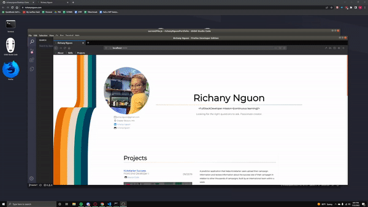

# 👋 Hey there, I'm Ethaeral.

### I love finding hidden patterns and creating something meaningful
- 💼 Software and ML Consultant at Cyberlete.io
- ❤️ I enjoy simple readable code and pretty documentation.
- 🌱 Recent grad of MIT Applied Data Science Program
- ⚡ Celtics Fan, CSGO and COD player!

### Languages and tools
#### Programming Languages: 
JavaScript, TypeScript, Python, C, C++, Java, Golang, Scala
#### Technologies and Frameworks: 
Git, React, Redux, NodeJs+Express, GNU Toolkit, GCP, Google AutoML, NestJS, Django, Flask, Jupyter Notebook, PostgreSQL, Apollo GraphQL, SQLite, Jest, Linux, HTML, CSS, LESS, SCSS, Springboot, NextJS, Nuxt3, Vue, DS toolkit

### Currently Working On
- A stealthy product with SAF LABS

### My old website I made while I was in my fullstack cert program

